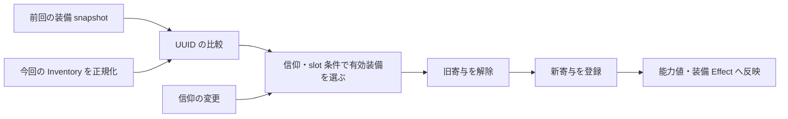

# 本体の抽象構造と変更の考え方

確認日: 2026-09-15。本体 HEAD `f88cdd5bcb2216d24b26e48684f4a7951a686c94` の定義・管理処理・呼出側を辿って整理した。ここでいう「寄与」「作業用の状態」「構築レシピ」は、実装上の関係を説明するための呼び方である。

本体を読むときは、個別のコマンドに加えて、その関数が扱う **定義、個体の状態、導出値、イベント、呼出中の作業領域** を区別する。同じ storage 操作でも、どれを変更するかによって責務と影響範囲が違う。

## 定義・状態・実行を分けて読む

| 抽象化されているもの | 実装上の例 | 変更時に守る境界 |
| --- | --- | --- |
| 型や配置の定義 | Mob/Object の register、Spawner の候補・位置・設定 | 定義を解釈して個体化する manager と、個体ごとの状態を区別する |
| 個体の状態 | OhMyDat の MobField、Effects、SpawnerData と entity score | 保存主体と寿命を特定し、別個体の状態と混ぜない |
| 処理中の状態 | asset:context this、Old/New、配送中の Attack/Hurt | 入口が何から作り、どこへ保存・配送するかを確認する |
| 寄与と導出値 | Attributes.Modifier と Attributes.Value | 寄与の追加・解除・再計算を通じて値を変更する |
| 行為と通知 | Damage API と所有者別のイベント列 | 行為の実行条件と、後で反応を呼ぶための記録を区別する |
| 共通の処理部品 | array session、ROM の参照窓、API の Argument/Return | 暗黙の局所変数と考えず、利用区間と上書き範囲を守る |

namespace はこの責務を探す入口になる。`api` は呼出契約、各 manager は状態の解釈と領域処理、`asset` は定義と振る舞い、`core:tick` は実行順と主体の編成を読む入口である。ただし、namespace 全体が一つの責務だけを持つと決めつけない。たとえば lib も作業 storage を使い、API 内部にも状態更新の実装がある。

[core tick](../../TheSkyBlessing/data/core/functions/tick/.mcfunction) の順序と、[ROM provide](../../TheSkyBlessing/data/rom/functions/provide.mcfunction) の数値アドレスから参照窓を提供する処理は、領域固有の意味を載せる基盤である。Mob/Object の継承という意味は、その上の実行系が与える。[型・継承の詳細](asset-runtime.md) を参照する。

## 領域ごとの状態モデルを選ぶ

共通の register や manager という名前だけで、同じ更新方式を当てはめない。次のコンポーネントは、それぞれ異なるものを状態の正本や処理結果として持つ。

| 領域 | 読むべき関係 | 詳細 |
| --- | --- | --- |
| Island | 解呪の状態機械、ボス型と追跡個体、成功時の通知 | [World コンポーネント](world-components.md) |
| Teleporter | 共通の接続一覧、設置 entity、選択 session の snapshot | [World コンポーネント](world-components.md) |
| Trader | 保存した定義、条件から作る Offers、購入後の個体化 | [World コンポーネント](world-components.md) |
| Container | 構築時に抽選・解決し、その後は block が保持する内容物 | [World コンポーネント](world-components.md) |
| Item・inventory | テンプレートからの生成と配送、snapshot と slot の書き戻し | [Runtime コンポーネント](runtime-components.md) |
| 墓・LostItems | 所有者側の保存内容、墓の世代、回収時の移管 | [Runtime コンポーネント](runtime-components.md) |
| Mob・追加当たり判定 | 共通個体表現、物理 proxy と論理本体、適用区間 | [Runtime コンポーネント](runtime-components.md) |
| 幾何・移動・ROM | tag、entity 位置、補正済み速度、共有参照窓による受け渡し | [Runtime コンポーネント](runtime-components.md) |

## API は呼出契約と拡張点を提供する

複合引数を `api: Argument` に置く API では、storage の入力だけでなく `@s`、実行位置、結果の受取先、引数の寿命までが呼出契約になる。これを一つの呼出フレームとして読む。詳細は [API と storage](api-and-storage.md)。

[Mob summon の公開契約](../../TheSkyBlessing/data/api/functions/mob/summon.mcfunction) は、型 ID、個体の FieldOverride、初期化途中へ差し込む callback を受け取る。[core](../../TheSkyBlessing/data/api/functions/mob/core/summon.mcfunction) が型定義の評価・Field 合成・生成を編成するので、呼出側は内部の alias や保存処理を組み直さずに個体生成を利用できる。

この拡張点を使う例が [Spawner の summon](../../TheSkyBlessing/data/asset_manager/functions/spawner/spawn/single/summon.mcfunction) である。`PreInitInterceptFn` によって Mob 固有の init より前に出自を設定する。Spawner 由来の個体情報を追加する場合、Mob の全 register を書き換えるより、まずこの既存の境界を確認する。

callback は処理を差し込める場所であり、周囲の共有状態を自動保護する保証ではない。呼出側が何を残したまま callback を実行するかを読む。Mob/Object の `call.m` も既存の個体 context 内での dispatch であり、別 entity の Field を読み込む API ではない。

## 保存される状態と処理用の状態

Mob の `this` は OhMyDat の MobField を処理中に展開したもので、[trigger 入口](../../TheSkyBlessing/data/asset_manager/functions/mob/triggers/.mcfunction) が読み出しと書き戻しを担う。この関係から、個別メソッド内で `this` 全体を片付けてはいけない理由が分かる。

Artifact の Old/New は別の役割を持つ。[Old の初期化](../../TheSkyBlessing/data/asset_manager/functions/artifact/data/old/init.mcfunction) はプレイヤー別の前回 ContextStash を取り出し、[New の初期化](../../TheSkyBlessing/data/asset_manager/functions/artifact/data/new/init.mcfunction) は現在の Inventory を処理向けの一定の形へ整える。最後に [New を保存](../../TheSkyBlessing/data/asset_manager/functions/artifact/data/new/stash_to_entity_storage.mcfunction) して、次回の比較対象にする。

したがって同じ `asset:context` でも、this は個体 Field の作業領域、Old/New は前回と今回を比較するための状態、Attack/Hurt は配送中のイベントである。新しい値を追加するときは、「一時値か永続値か」だけでなく、何を表す値で誰が次に読むかを決める。

## 能力補正は識別できる寄与から組み立てる

[Heal modifier の追加](../../TheSkyBlessing/data/api/functions/modifier/core/heal/add.mcfunction) は、`UUID`、`Amount`、`Operation` を持つ寄与を保存し、同じ UUID の既存寄与を置き換えて値を再計算する。これは、最終値へ増減を直接書き込む方法とは異なる状態モデルである。

`Attributes.Default` が基礎値、`Attributes.Modifier` が寄与の集合、`Attributes.Value` が利用側の読む導出値になる。[共通の再計算](../../TheSkyBlessing/data/api/functions/modifier/core/common/update_modifier/.mcfunction) は Operation ごとの順序に従って値を構成する。解除対象を UUID で特定できるため、複数の装備・効果が重なっても自分の寄与だけを取り除ける。

この共通計算の式は、固定小数点の丸めを除けば `(Default + Σ add) × (1 + Σ multiply_base) × Π (1 + multiply)` である。Operation の名前が似ていても、加算する倍率と個別に掛ける倍率を混同しない。UUID は呼出側が指定する寄与の論理キーであり、API が自動で一意な出典を作るわけではない。

装備との接続では、[remove](../../TheSkyBlessing/data/asset_manager/functions/artifact/triggers/equipments/set_and_modifier/remove/process.mcfunction) と [add](../../TheSkyBlessing/data/asset_manager/functions/artifact/triggers/equipments/set_and_modifier/add/process.mcfunction) が `Equipment.Modifiers` 各要素の `ID` と slot から寄与の UUID を組み立てる。API 経路では `[1, 1, Modifier.ID, SlotEnum]` を用い、vanilla attribute 経路では slot 表現を変えて UUID 文字列へ変換する。Artifact ID やアイテム個体の `tag.TSB.UUID` をそのまま使う仕組みではない。装備の変更検知に使う UUID と、寄与を識別する UUID は役割が違う。

「装備で Heal を補正する」変更なら、既存の modifier 定義と Operation を使う。Value だけを直接変更すると、後の再計算や装備解除との対応を失う。基礎値の変更、継続する寄与、単発の Damage/Heal 入力補正のどれを実現したいかで変更先を決める。max-health の個別処理や vanilla attribute、custom modifier の dispatch もあるため、全能力値が同一の計算経路とは限らない。

## 装備は前回との差から有効状態を組み直す

装備の管理は、Inventory の変更を見つけて任意の callback を呼ぶだけではない。現在の装備を一定の slot 形状に整え、前回との差分を取り、信仰や装備 slot の条件を満たすものから有効な寄与を組み直す。

[装備比較](../../TheSkyBlessing/data/asset_manager/functions/artifact/triggers/equipments/compare.mcfunction) は array lib で slot ごとの変化を得る。[有効装備の filter](../../TheSkyBlessing/data/asset_manager/functions/artifact/triggers/equipments/set_and_modifier/filter/.mcfunction) と旧状態の比較から remove/add を行う。[trigger の編成](../../TheSkyBlessing/data/asset_manager/functions/artifact/triggers/.mcfunction) は、信仰が変わった場合もこの更新を起動する。

この構造を理解すると、装備条件の追加では filter と再評価の契機、新しい補正の追加では寄与の登録・解除、新しいアイテム情報では正規化と snapshot の保存を確認すべきだと分かる。レビューでは「装備したとき効く」だけでなく、外す・交換する・信仰だけを変える場合にも同じ状態へ収束するかを見る。

## 行為とイベントへの反応を分ける

[Damage の実行](../../TheSkyBlessing/data/api/functions/damage/core/attack.mcfunction) は対象の状態と補正を使ってダメージを適用する。一方、その行為への Artifact/Mob の反応は、所有者別の `ArtifactEvents`／`MobEvents` に記録されたイベントを配送する経路を持つ。

[イベントの作成](../../TheSkyBlessing/data/api/functions/damage/core/trigger_events/player/attack_and_damage/.mcfunction) と、[複数対象をまとめる Attack 記録](../../TheSkyBlessing/data/api/functions/damage/core/trigger_events/non-player/attack_and_hurt/attack.mcfunction) を、単なるログとして読まない。後者は集約用 Index と `To[]`／`Amounts[]` の対応を持ち、後でどの所有者に何を伝えるかを定める。

配送側は [Artifact attack](../../TheSkyBlessing/data/asset_manager/functions/artifact/triggers/attack/foreach.mcfunction) や [Mob hurt](../../TheSkyBlessing/data/asset_manager/functions/mob/triggers/hurt/foreach.mcfunction) でイベントを context に展開し、必要な対象を ID から一時 tag へ解決して反応を呼ぶ。呼出時刻は owner の処理順に依存する。同期 callback とみなしたり、常に次 tick だと決めつけたりしない。vanilla 由来の被ダメージには advancement・entity finder の別入口もある。

[Artifact の trigger 入口](../../TheSkyBlessing/data/asset_manager/functions/artifact/triggers/.mcfunction) と [Mob の入口](../../TheSkyBlessing/data/asset_manager/functions/mob/triggers/.mcfunction) は、owner のイベント群を作業 storage へ取り出し、保存元を空にしてから配送する。このため、反応中に新しく記録されたイベントは処理中の取り出し済みの列へ混入しない。また、[プレイヤーへのダメージ適用](../../TheSkyBlessing/data/api/functions/damage/core/health_subtract/player/.mcfunction) では enqueue が体力反映より先にある。記録と体力反映の順序まで一律に扱わない。

新しい reaction 用情報を追加する場合は、API の入力、イベント記録、集約、配送 context、利用側を一続きで確認する。Damage 計算中から反応関数を直接呼ぶ変更は、その反応が前提とする装備状態や owner context を用意できているかを問う。

## 緩衝体力は複数の防壁とその表示を分ける

プレイヤーの緩衝体力も、金ハートの数値一つで表すと構造を見落とす。[add API](../../TheSkyBlessing/data/api/functions/entity/player/absorption/add.mcfunction) は UUID、Amount、Priority、WipedCallback を受け取り、owner の OhMyDat `Absorptions[]` に防壁を保持する。[upsert](../../TheSkyBlessing/data/api/functions/entity/player/absorption/core/upsert.m.mcfunction) は同じ UUID の要素全体を置き換える。UUID が識別するのは防壁・効果の出典であり、対象プレイヤーは実行主体 `@s` で指定する。

ダメージを受けると [Priority 順の取り出し](../../TheSkyBlessing/data/lib/functions/score_to_health_wrapper/core/absorb_damage/get_absorptions.mcfunction) と [消費・callback](../../TheSkyBlessing/data/lib/functions/score_to_health_wrapper/core/absorb_damage/foreach.mcfunction) が働く。高い Priority から消費し、防壁を使い切ると callback を被ダメージプレイヤーとして呼ぶ。一方、[player_manager の absorption](../../TheSkyBlessing/data/player_manager/functions/absorption/.mcfunction) は全 Amount の合計を金ハート表示へ反映する。防壁の所有、ダメージによる消費、画面上の表示が分担されている。

新しい防壁を実装する側は、出典の UUID、Priority の範囲 0–10、同 UUID の add が加算ではなく置換であることを守る。API には有効期限の項目がないため、期限付きなら呼出側の lifecycle が同じ UUID で remove する責務を持つ。[API 用の確認コード](../../TheSkyBlessing/data/minecraft/functions/tests/absorption_api/test.mcfunction) が呼出例になる。この例は読解したもので、今回実行はしていない。

## World の定義を実行中の個体へ変換する

Spawner の [register 例](../../TheSkyBlessing/data/asset/functions/spawner/2147483647/register.mcfunction) は、位置、候補、範囲、delay 等の構築用データを提供する。[Nexus loader](../../TheSkyBlessing/data/world_manager/functions/nexus_loader/try_load_asset/m.mcfunction) が生成条件と DPR の既存登録を確認し、必要な対象を construct へ渡す。定義、構築の判断、構築された個体を分けて読む。

Spawner manager は [候補形式の正規化](../../TheSkyBlessing/data/asset_manager/functions/spawner/register/construct/process_spawn_potentials/.mcfunction) で複数の入力形式を重み付き候補へ揃え、[個体データの設定](../../TheSkyBlessing/data/asset_manager/functions/spawner/register/construct/set_data.mcfunction) で SpawnerData と entity score に実行中の状態を保持する。[tick](../../TheSkyBlessing/data/asset_manager/functions/spawner/tick/.mcfunction) と [spawn](../../TheSkyBlessing/data/asset_manager/functions/spawner/spawn/.mcfunction) は、近接プレイヤー、cooldown、個体上限、候補選択を扱い、最終的に Mob summon を利用する。

正規化時に Mob を抽選するわけではない。構築時には候補表と重み合計を準備し、実際の [Mob ID の選択](../../TheSkyBlessing/data/asset_manager/functions/spawner/spawn/choose_mob_id/.mcfunction) は spawn 時に行う。定義の変更が既存個体に反映されるかを調べる場合も、DPR の保存状態と再構築の入口を確認する。DPR は loader の呼出後も残る構築抑止の印であり、個体の存在を追跡する台帳ではない。[Nexus の境界](world-components.md) を参照する。

この境界では register は構築レシピ、manager はその解釈と実行を担う。候補の新しい記法は正規化、spawn 条件は manager、Mob 自身の能力は Mob 定義、配置条件は定義と loader の境界から変更先を探す。

Island も loader/construct の境界を持つが、[個体の設定](../../TheSkyBlessing/data/asset_manager/functions/island/register/construct/set_data.mcfunction) には IslandData と DispelPhase があり、進行状態を管理する。Spawner の候補選択や Mob/Object のメソッド継承を、すべての world asset に適用しない。

## 共通部品には利用区間がある

[array session の open](../../TheSkyBlessing/data/lib/functions/array/session/open.mcfunction) と [close](../../TheSkyBlessing/data/lib/functions/array/session/close.mcfunction) は、共有の入力列・作業列・結果を準備し、使用後に削除する。[compare](../../TheSkyBlessing/data/lib/functions/array/compare.mcfunction) は入力を消費しながら結果を作る。装備比較などの呼出側は、この利用区間の所有者である。

これはロックで再入を防ぐ機構ではない。二重 open の診断があっても、外側の作業状態を自動退避するわけではない。session 中に callback や別 API を呼ぶ変更では、その先が同じ array 作業領域を使うか確認する。同様に、API 引数、ROM の参照窓、OhMyDat pointer も、名前が共通であることを局所性や再入安全性の保証にしない。

## 実装・レビューでの使い方

変更対象について、次の4点をコードで説明できるようにする。

1. 何を表す値か。定義、個体状態、snapshot、寄与、導出値、イベントのどれか。
2. 誰が変更・保存するか。呼出側、API、manager、asset callback の境界はどこか。
3. 既存の何を差し替えるか。FieldOverride、callback、候補データ、modifier、event payload 等の拡張点が使えるか。
4. 何を保てば元に戻せるか。寄与 ID、slot 対応、イベントの配列対応、保存時点、作業領域の寿命を確認する。

新しい抽象を導入する前に、この経路にある既存の拡張点を探す。一方で、名前や見た目が似るだけの領域を同じ仕組みへまとめず、実際の所有権と呼出契約を根拠に判断する。
